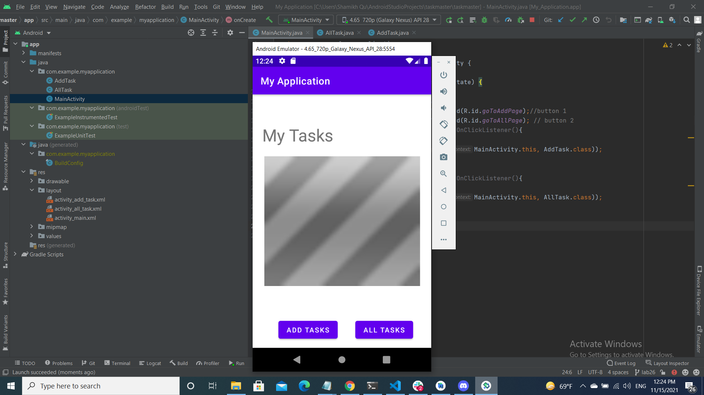
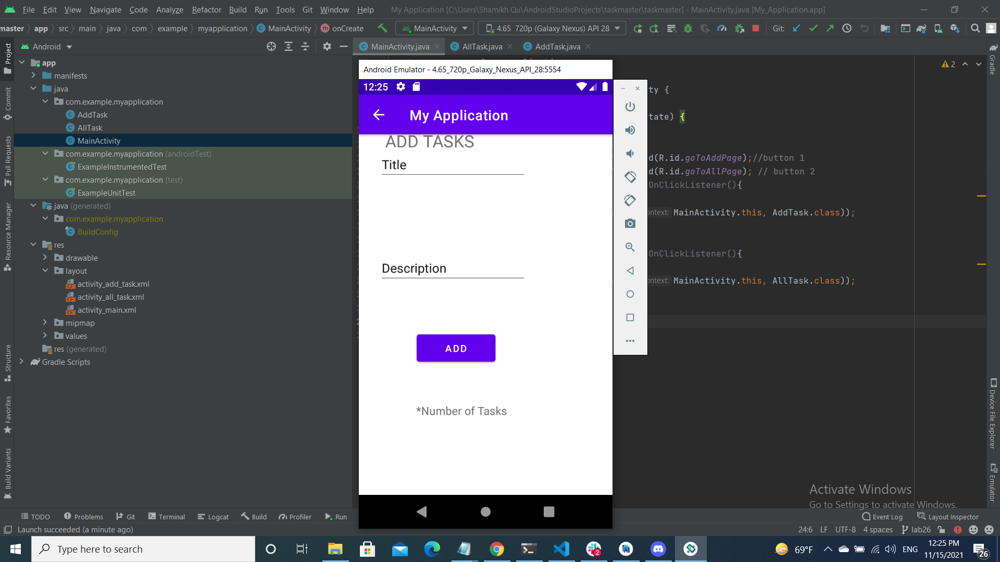
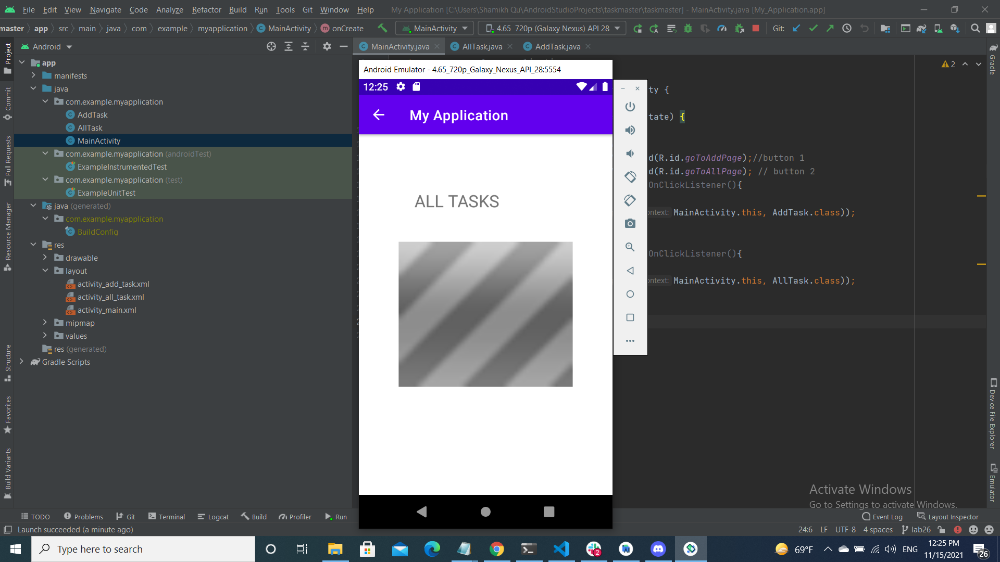
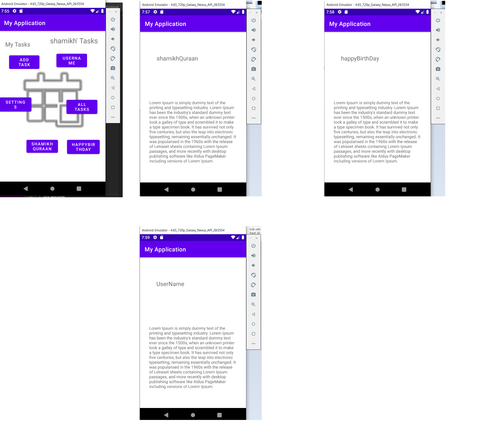
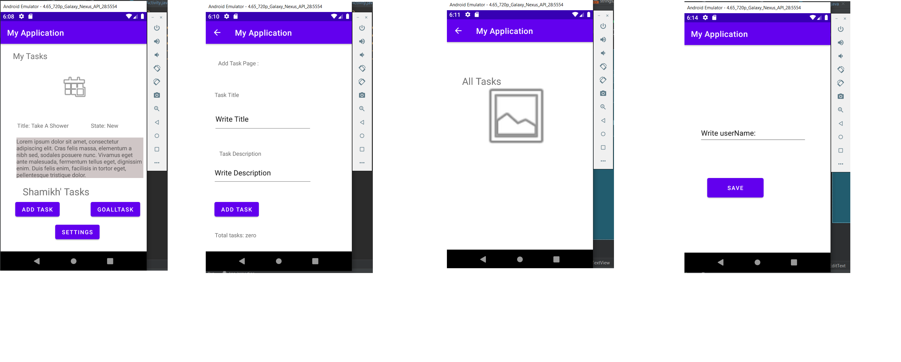
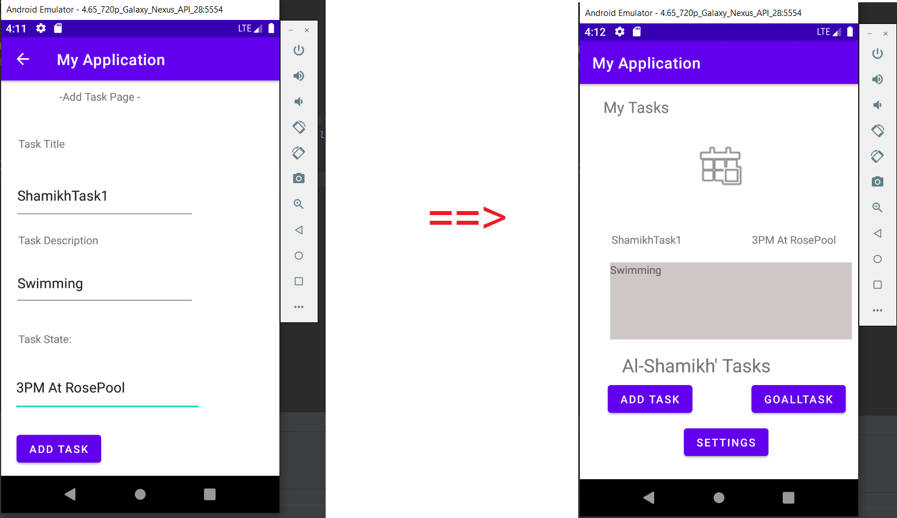
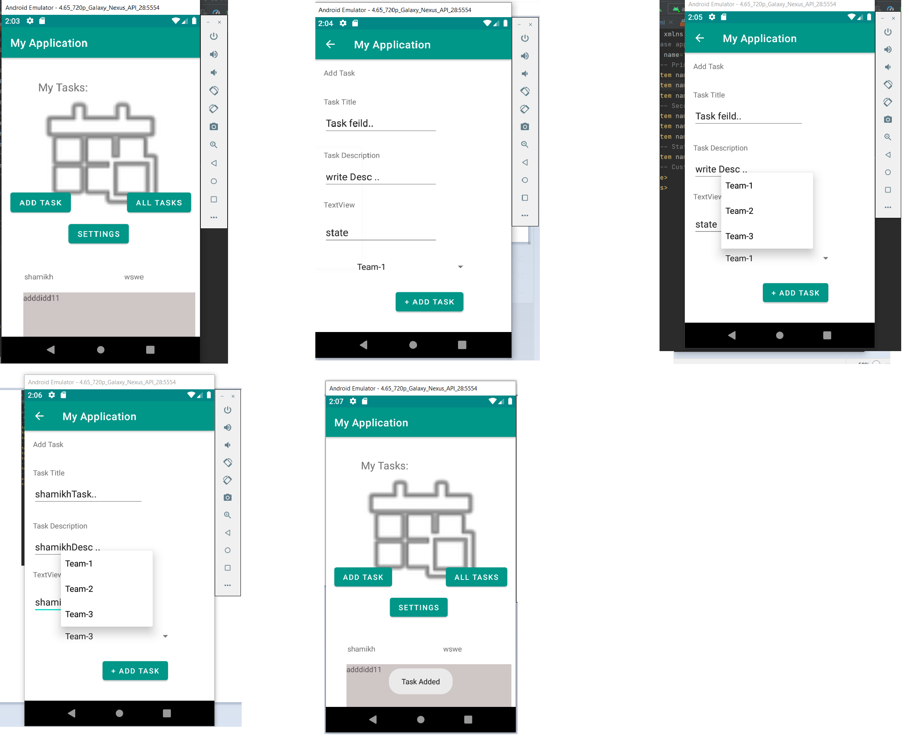
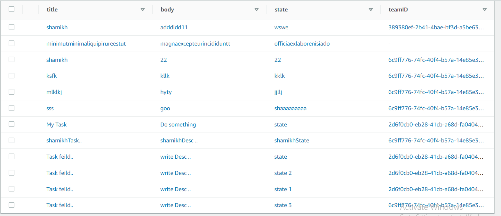

# taskmaster

## lab26:
### Main activity page :

### Add activity page :

### All activity page :

## lab27:
### Ther other page in apllication:

## lab28:

## lab29:

## lab32:
### After Adding To DB , the Tasks that u added u will see it at TaskBar At Home pages .

## lab33:

### Build & Deploy TaskMaster to Android Using DynamoDB
 ,  OverView allow users to keep track of tasks to be done and their status.
 ### Made , 
 relationShip between tow table Task with Team and deploay them with each Other.

  

 ### Tables :

 

  